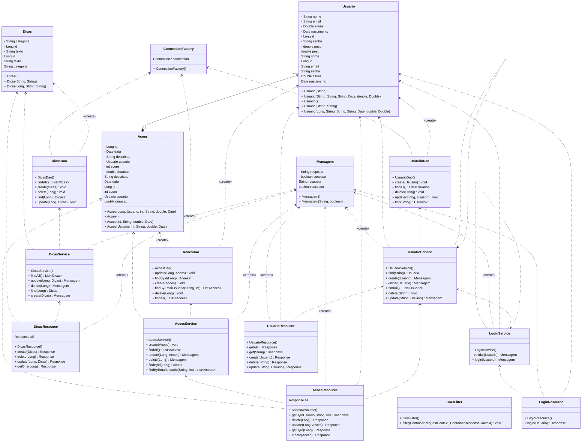

# ArtificialCareApi 

# Endpoints

## Usuário:
- `GET` URL+/webapi/usuario (GET ALL CLIENTES)
- `GET` URL+/webapi/usuario/{email} (GET BY EMAIL)
- `PUT` URL+/webapi/usuario/{email}
```
Body: {
	"nome" : "Nome do Usuario",
	"email" : "nome@email.com",
	"senha" : "senha123",
	"peso" : 74,
	"altura" : 1.82,
	"nascimento" : "2005-07-01"
      }
```
- `DELETE` URL+/webapi/usuario/{email}
- `POST` URL+/webapi/usuario/
```
    Body: {
	"nome" : "Nome do Usuario",
	"email" : "nome@email.com",
	"senha" : "senha123",
	"peso" : 80,
	"altura" : 1.92,
	"nascimento" : "2005-07-01"
      }
``` 
## Ações:
- `GET` URL+/webapi/acoes (GET ALL Dicas)
- `GET` URL+/webapi/acoes/{id} (GET BY ID)
- `GET` URL+/webapi/acoes/{emailCliente}/{qtd} (GET BY Email/Qtd) </br>
*A quantidade de açoes que quer obter. caso peça 4 e tenha 2: retorna 2*
- `PUT` URL+/webapi/acoes/{id}
```
Body: {
	"data": "2023-01-01Z",
	"descricao": "Ação 1",
	"duracao": 32,
	"score": 1
}
```
- `DELETE` URL+/webapi/acoes/{id}
- `POST` URL+/webapi/acoes
```
Body: {
	"data": "2023-01-01Z",
	"descricao": "Ação 1",
	"duracao": 32,
	"score": 1,
	"usuario": {
		"email": {email}
	}   
 }
 ```
## Dicas:
- `GET` URL+/webapi/dicas (GET ALL CLIENTES)
- `GET` URL+/webapi/webapi/dicas/{id} (GET BY ID)
- `PUT` URL+/webapi/dicas/{id}
```
Body: {
	"categoria" : "Bom",
	"texto" : "Continue nesse ritmo!"
}
```
- `DELETE` URL+/webapi/dicas/{id}
- `POST` URL+/webapi/dicas
```
Body: {
	"categoria" : "Bom",
	"texto" : "Continue assim!"
}
```

## Login: 
- `POST` URL+/webapi/login
```
Body: {
 	 "email" : "nome@email.com",
	"senha" : "senha123"
}
```
## Diagrama de classes

